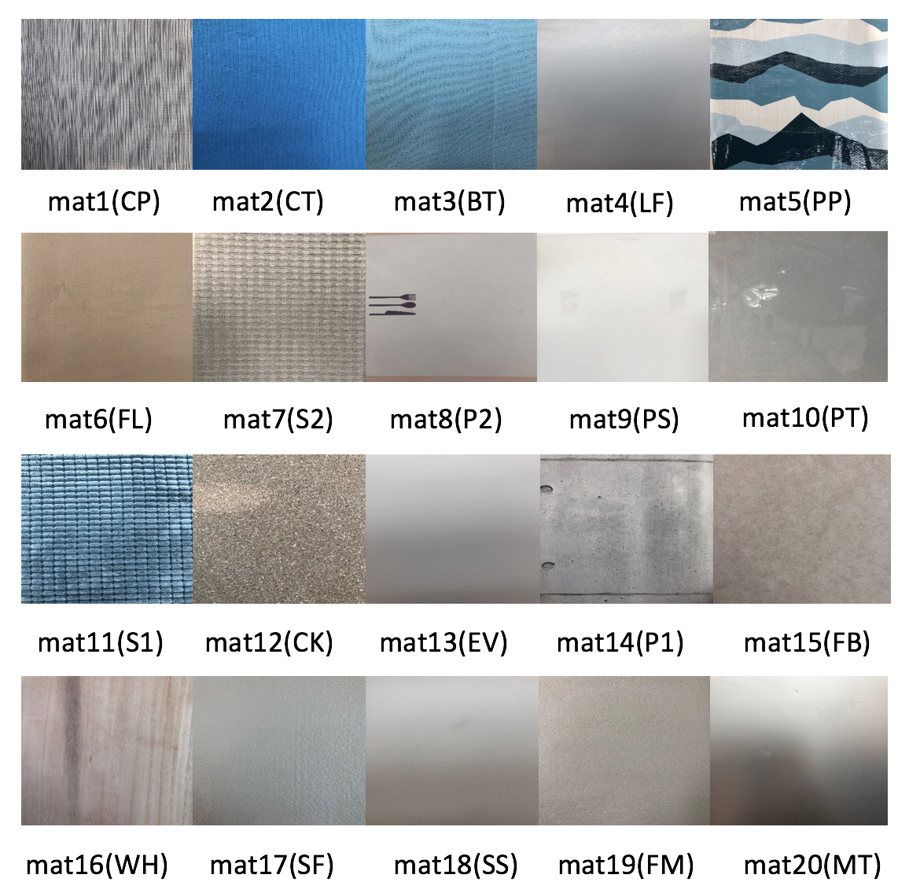

# BioTac_slide_20_50
This repository contains tactile data and material description for texture classification, supplementary to the paper "Supervised  Autoencoder  Joint  Learning  on  Heterogeneous  TactileSensory  Data:  Improving  Material  Classification  Performance", R. Gao et al.

We have included both the raw data and the compiled data here. The raw data includes a comprehensive range of modalities, provided by both tactile sensors and the robot arm. The compiled data includes purely the sensor data that are used in the abovementioned paper and have already been splitted in to train/validation/test sets.

## Dataset description
This dataset concerns with 20 classes named with `mat + x`, where `x` is an index number. A snapshot of each corresponding material is shown below and the detailed description for each material can be found in `material_properties` text file by the name index or two-letter code.

<br/>

### Raw data set
Each material constitutes a separate folder in which 50 samples are presented, named by `matx_n`, where `x` is the material index and `n` is the sample index. For each sample, we have a series of `.csv` files compiled from original `rosbag` data and one `.pt` file that was used as input data for BioTac model mentioned in the above paper. <br/>
* For `.csv` files, the postfix after sample name indicates the recorded ros topic: `bio`-- BioTac sensor reading, `cp`-- cartesian position, `cv`-- cartesian velocity, `cw`-- cartesian wrench, `jp`-- joint position, `jt`-- joint torque, `jv`-- joint velocity. They are mostly used for checking the effectiveness of force control and velocity control for consistent data collection and can be further explored for future experiments.
* For `.pt` file, it is extracted from `_bio.csv` file for each sample and formatted as a `400*44` tensor, where `400` is the sequence length and `44` is the number of the data fields, as shown in the header of `_bio.csv` file. It can be directly imported by `torch.load(filename)` and used as input data for model training.
<br/>

### Compiled data set
The processed data set is presented to facilitate quick implementation in PyTorch. The data can be loaded with following commands
```
from tas_utils_bs import get_trainValLoader, get_testLoader
# data_dir = 'compiled_data/'
# kfold_number = 0 # number of fold that is chosen as the validation fold, range 0-3
# spike_ready = False # the data can be used for SNN training if the option is True
# batch_size = 32
# shuffle = True # where the data is shuffled for each epoch training 
train_loader, val_loader, train_dataset, val_dataset = get_trainValLoader(data_dir, k=kfold_number, spike_ready=False, batch_size=batch_size, shuffle=shuffle)
test_loader, test_dataset = get_testLoader(data_dir, spike_ready=False, batch_size=batch_size, shuffle=shuffle)
```


